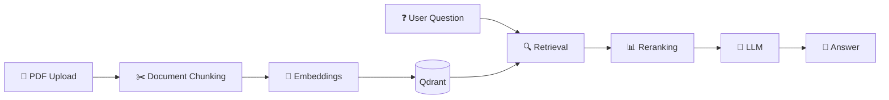
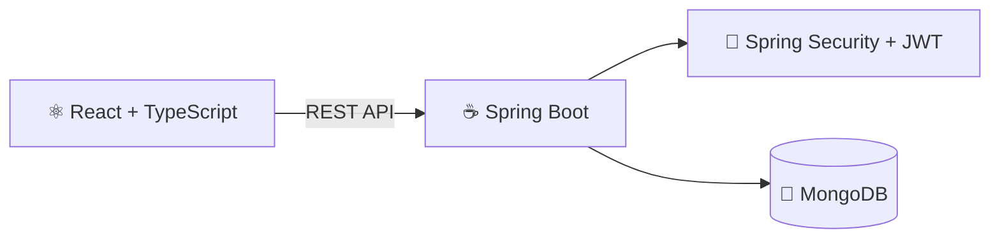
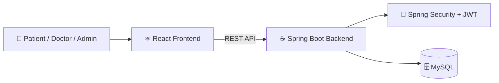
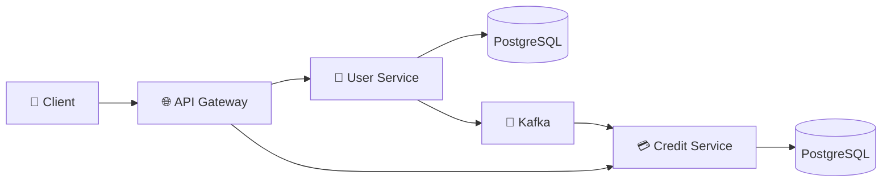

# 👋 Hi, I'm Sahil Shinde

### 💻 Software Engineer | Java • Spring Boot • React | Backend & Full-Stack Development

I'm a Software Engineer based in Pune, India, with around 2 years of experience building backend and full-stack applications.

I primarily work with Java, Spring Boot, REST APIs, Kafka, databases, and React. I enjoy building reliable backend systems, working with event-driven architectures, and developing practical full-stack applications.

---

## 🛠️ Tech Stack

### Backend
- Java
- Spring Boot
- Spring Security
- JPA / Hibernate
- REST APIs
- Microservices
- Apache Kafka

### Frontend
- React
- TypeScript
- JavaScript

### Databases
- PostgreSQL
- MySQL
- MongoDB
- Redis

### Testing & Tools
- JUnit
- Mockito
- Testcontainers
- Git
- GitHub
- Maven
- Docker
- GitHub Actions

### AI / RAG
- Python
- FastAPI
- LangChain
- Qdrant
- HuggingFace
- RAGAS

---

# 🚀 Featured Projects

## ⚙️ Claims Processing System

Backend-focused claims management system built using Java and Spring Boot.

### Key Features
- JWT-based authentication and role-based authorization
- Controlled claim-state transitions
- PostgreSQL persistence with Flyway migrations
- Redis caching
- Kafka-based asynchronous processing
- Audit history and idempotent operations
- JUnit, Mockito and Testcontainers based testing
- Dockerized development environment
- GitHub Actions CI

### Tech Stack

`Java` `Spring Boot` `PostgreSQL` `Redis` `Kafka` `Spring Security` `Docker` `Testcontainers`

---

## 🤖 RagLens — Evaluation-First RAG System

AI-powered document question-answering system focused on retrieval quality and measurable RAG evaluation.

### Key Features
- PDF document ingestion
- Vector search using Qdrant
- HuggingFace embeddings
- MMR-based retrieval
- CrossEncoder reranking
- RAGAS evaluation pipeline
- React-based frontend
- FastAPI backend

### Tech Stack

`Python` `FastAPI` `LangChain` `Qdrant` `HuggingFace` `RAGAS` `React`

### Application Flow



---

## 💼 HireHub — Job Portal

Full-stack job portal application built for managing jobs, users, applications and authentication.

### Key Features
- User authentication using JWT
- Job creation and management
- Job search and browsing
- Job application workflows
- Role-based functionality
- REST API integration between frontend and backend

### Architecture



### Tech Stack

`Java` `Spring Boot` `React` `TypeScript` `MongoDB` `JWT`

---

## 🏥 Homeopathy Clinic Platform

Full-stack clinic management application developed for managing patients, doctors, appointments and medical records.

### Key Features
- Patient, Doctor and Admin roles
- JWT authentication
- Role-based access control
- Appointment management
- Patient record management
- REST APIs
- Responsive React interface
- MySQL database integration

### Architecture



### Tech Stack

`Java` `Spring Boot` `React` `TypeScript` `MySQL` `Spring Security` `JWT`

---

## 🏦 Credit Risk Platform

Microservices-based backend application for user management and credit processing.

### Architecture



### Key Features
- Spring Cloud Gateway
- Independent backend services
- JWT authentication
- PostgreSQL persistence
- Kafka event communication
- Flyway database migrations
- Integration testing with Testcontainers

### Tech Stack

`Java` `Spring Boot` `Microservices` `Kafka` `PostgreSQL` `Spring Security` `Spring Cloud Gateway`

---

# 🧠 What I'm Currently Working On

- 🧩 Data Structures & Algorithms using Java
- ☕ Advanced Java and Spring Boot
- 🏗️ Backend and System Design fundamentals
- 🔄 Event-driven architecture using Kafka
- 🧪 Unit and integration testing
- 🤖 Practical AI / RAG applications

---

# 💡 Engineering Interests

```text
Backend Development
        │
        ├── Java / Spring Boot
        │
        ├── REST APIs
        │
        ├── Microservices
        │
        ├── Kafka
        │
        └── Databases
        │
        ▼
Full-Stack Engineering
        │
        ├── React
        └── TypeScript
        │
        ▼
AI-Enabled Applications
        │
        ├── RAG
        ├── Vector Databases
        └── LLM Integration
```

---

# 📚 Problem Solving

I regularly practice Data Structures and Algorithms using Java, focusing on:

- Arrays & Strings
- Hashing
- Two Pointers
- Sliding Window
- Binary Search
- Linked Lists
- Stack & Queue
- Trees
- Graphs
- Dynamic Programming

My focus is on understanding patterns, comparing brute-force and optimized approaches, and analyzing time and space complexity.

---

# 🤝 Connect With Me

📍 Pune, India

💼 LinkedIn: https://www.linkedin.com/in/sahilshinde3801

💻 LeetCode: https://leetcode.com/shindesahil206/

🌐 Portfolio: https://sahil-shinde-dev.netlify.app/

📧 Email: shindesahil206@gmail.com

---

### 🚀 Building reliable software, improving problem-solving skills, and continuously learning better engineering practices.
